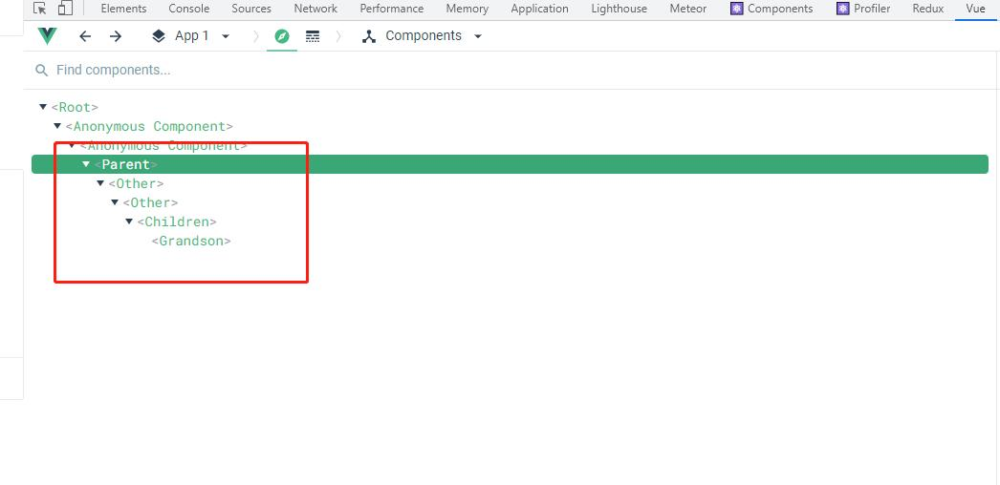

import { Meta, Story } from "@storybook/addon-docs/blocks";

<Meta title="Element UI/Mixins/Emitter/广播通讯 emitter.MDX" />

## emitter

> emitter.js : 用于事件通讯，虽然 Vue.js 1 已经放弃使用这种方法了（反模式的一种），但是也不失为一种组件通讯方法，Element UI 里有大量组件使用到它，但是请谨慎使用，做好组件的内部封装

### 前置条件

1. 在 Element ui 框架中的每一个组件都会有`componentName`属性，用来标识自己
2. 确保组件与组件之间的父子关系，确保组件有`$parent`以及`$children`

### 参考资料

1. [vm.$children](https://cn.vuejs.org/v2/api/#vm-children)
2. [vm.$parent](https://cn.vuejs.org/v2/api/#vm-parent)
3. [【前端发动机】Vue 组件间通信方式完整版](https://zhuanlan.zhihu.com/p/60250686)

## 参考例子

1. Parent 注册一个事件(click)，用于和其他组件进行通讯
2. Parent 点击呼叫孙子节点的按钮，就会向下子节点，只有对应名称的子节点才会触发
3. Grandson 注册一个事件(click)，用于和其他组件进行通讯
4. Grandson 点击呼叫祖父节点的按钮，就会向上抛出事件，只有对应名称的父节点才会触发


---------

<Story
  id="element-ui-mixins-emitter-广播通讯-emitter--with-basic"
  name="withBasic"
/>

---------


---------

### Parent 组件

```javascript
<template>
  <div class="parent">
    <Other>
      <Other><Children /></Other>
    </Other>
    <button @click="handleClick">呼叫孙子节点</button>
  </div>
</template>

<script>
import emitter from "element-ui/src/mixins/emitter";
import Children from "./Children.vue";
const Other = {
  componentName: "Other",
  render() {
    return (
      <div class="other">
        {this.$scopedSlots.default && this.$scopedSlots.default()}
      </div>
    );
  },
};
export default {
  componentName: "Parent",
  name: "Parent",
  components: {
    Other,
    Children,
  },
  mixins: [emitter],
  mounted() {
    this.$on("click", (payload) => {
      alert(payload);
    });
  },
  methods: {
    handleClick() {
      this.broadcast("Grandson", "click", "孙子节点收到");
    },
  },
};
</script>


```

### Chidren 组件

```javascript
<template>
  <div>
    <Grandson />
    <p>-----子节点------</p>
  </div>
</template>

<script>
import Grandson from "./Grandson.vue";
export default {
  componentName: "Children",
  components: {
    Grandson,
  },
  mounted() {
    this.$on("click", (payload) => {
      alert(payload);
    });
  },
};
</script>


```

### Grandson 组件

```javascript
<template>
  <button @click="handleClick">呼叫祖父节点</button>
</template>

<script>
import emitter from "element-ui/src/mixins/emitter";
export default {
  mixins: [emitter],
  componentName: "Grandson",
  methods: {
    handleClick() {
      this.dispatch("Parent", "click", "祖父节点收到");
    },
  },
  mounted() {
    this.$on("click", (payload) => {
      alert(payload);
    });
  },
};
</script>


```

## 源码

```javascript
function broadcast(componentName, eventName, params) {
  this.$children.forEach((child) => {
    var name = child.$options.componentName;

    if (name === componentName) {
      child.$emit.apply(child, [eventName].concat(params));
    } else {
      broadcast.apply(child, [componentName, eventName].concat([params]));
    }
  });
}
export default {
  methods: {
    dispatch(componentName, eventName, params) {
      var parent = this.$parent || this.$root;
      var name = parent.$options.componentName;

      while (parent && (!name || name !== componentName)) {
        parent = parent.$parent;

        if (parent) {
          name = parent.$options.componentName;
        }
      }
      if (parent) {
        parent.$emit.apply(parent, [eventName].concat(params));
      }
    },
    broadcast(componentName, eventName, params) {
      broadcast.call(this, componentName, eventName, params);
    },
  },
};
```
